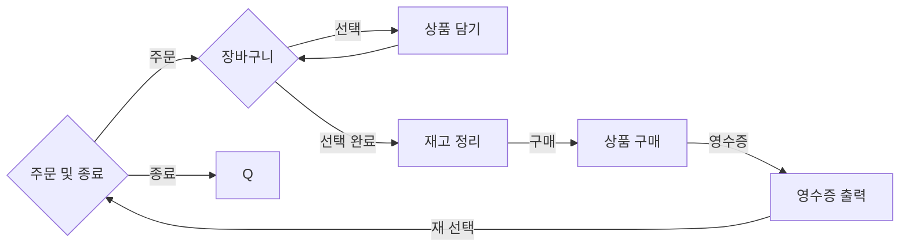

# Summary

주문 구매 프로그램 시퀀스 및 개요

## Controller

### Order

"Controller" (Router) 에서 행위에 따라 Service 가 분기되며 행위에 대한 분기를 담당 합니다.

"Scanner" 을 통해서 입력을 받는 주체 이며 주문에 대한 기능의 분기를 담당 합니다.

장바구니를 보유 하고 있으며 주문, 구매 시 콘솔 출력에 대한 문구가 설정 되어 있습니다.

## Service

### Pay

"구매" 에 대한 기능이 정의 되어 있습니다.

영수증을 생성 및 저장 하고 이에 대하여 출력 합니다.

### Product

"상품" 을 관리에 대한 기능이 정의 되어 있습니다.

상품의 입력 및 조회를 하며 장바구니의 재고에 대한 기능을 제공 합니다.

## Entity

### ProductInfo

"상품" 의 기본 정보 입니다.

상품의 ID, 이름, 값 과 같은 기본 정보가 입력 되어 있습니다.

### Product

"상품" 과 "재고" 에 대한 정보 입니다.

위의 info와 해당 상품의 재고 수량이 포함되어 있습니다.

### Receipt

"상품정보" 와 "구매 갯수", 결제 값, 배송비 여부, 구매 시간, 유저회원 이 포함 되어 있습니다.

